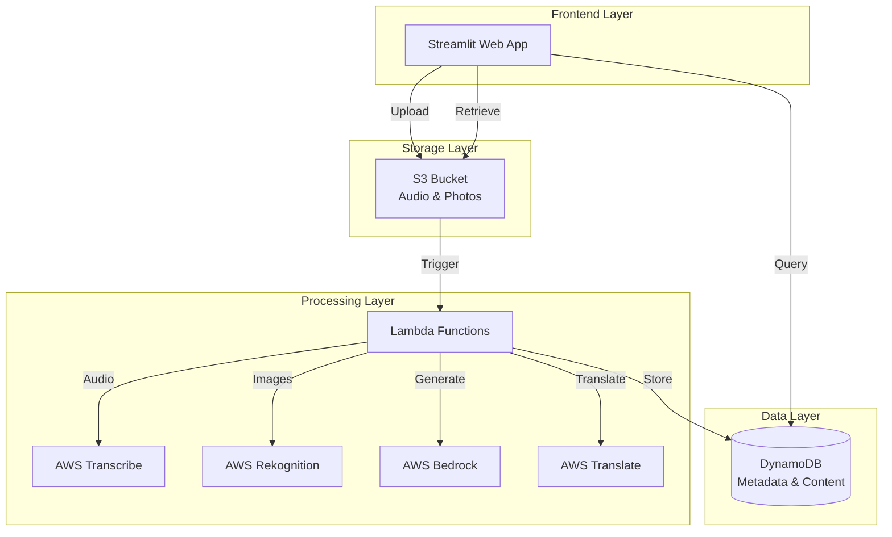
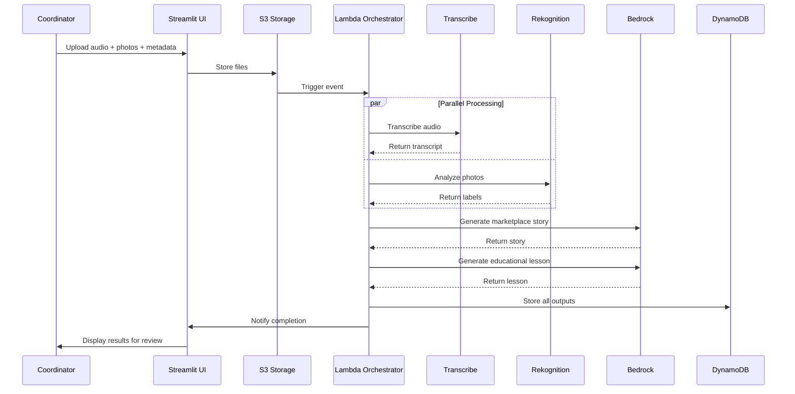

# Design Document: HeritageAI Bharat Platform

> **Designed for solo hackathon MVP with AWS free tier constraints (₹0-1,000 budget, 2-week timeline)**

## Overview

The HeritageAI Bharat Platform's core innovation is a **dual-output pipeline** that transforms a single artisan documentation session (voice interview + photos) into two valuable outputs: an authentic marketplace story for direct sales and a culturally relevant STEM lesson for students. This creates a self-sustaining model where marketplace revenue (15% platform share) funds free educational content, while preserving rural Indian craft heritage through AI-powered documentation.

The system uses a serverless, event-driven architecture on AWS where file uploads trigger an orchestrated pipeline of AI services (Transcribe for speech-to-text, Rekognition for image analysis, Bedrock for content generation) that produces multilingual content in Hindi, English, and Tamil. The design prioritizes cost efficiency (AWS free tier), low-bandwidth optimization for rural coordinators, and cultural authenticity through context-aware AI generation.

## Architecture

### High-Level Architecture



### Processing Flow



### Deployment Architecture

- **Frontend**: Streamlit app deployed on AWS EC2 t2.micro (free tier) or locally for MVP
- **Storage**: Single S3 bucket with folders: `/audio`, `/photos`, `/generated`
- **Compute**: Lambda functions with 512MB memory, 5-minute timeout
- **Database**: DynamoDB with on-demand billing
- **Networking**: CloudFront CDN for static assets (optional for MVP)

## Components and Interfaces

### 1. Upload Handler Component

**Responsibility**: Manages file uploads from coordinators with validation and compression.

**Key Operations**:
- `validate_upload()`: Validates session has required files and metadata
- `compress_file()`: Compresses audio/image files for low-bandwidth upload
- `upload_to_s3()`: Uploads files to S3 with progress tracking

**Design Decisions**: Client-side compression, chunked uploads with retry, pre-signed URLs for direct S3 upload

### 2. Transcription Service Component

**Responsibility**: Converts audio to text using AWS Transcribe with language detection.

**Key Operations**:
- `start_transcription()`: Initiates AWS Transcribe job with automatic language detection
- `get_transcription_result()`: Retrieves completed transcription with timestamps
- `validate_accuracy()`: Checks if transcription meets 80% accuracy threshold

**Design Decisions**: AWS Transcribe auto language ID for Hindi/English/Tamil, word-level timestamps, confidence thresholds, retry with exponential backoff

### 3. Vision Analysis Component

**Responsibility**: Extracts visual labels and text from artisan photos using AWS Rekognition.

**Key Operations**:
- `analyze_image()`: Detects objects, tools, materials in photos
- `extract_text()`: Performs OCR on images to extract visible text
- `filter_relevant_labels()`: Filters labels by confidence and relevance to crafts

**Design Decisions**: Rekognition DetectLabels API (70% confidence), DetectText for OCR, craft-relevant filtering, batch processing

### 4. Content Generation Component

**Responsibility**: Generates marketplace stories and educational lessons using AWS Bedrock.

**Key Operations**:
- `generate_marketplace_story()`: Creates authentic product story for marketplace (300-500 words)
- `generate_educational_lesson()`: Creates NCERT-aligned STEM lesson from craft
- `translate_content()`: Translates content to target language preserving context

**Design Decisions**: AWS Bedrock with Claude/Llama, structured prompts, temperature=0.7, AWS Translate for multilingual support

**Marketplace Story Prompt Template**:
```
You are a cultural storyteller preserving Indian artisan heritage.
Context: Artisan {name}, Craft {type}, Interview: {transcript}, Visual: {labels}
Generate story in {language} with sections: Artisan Background (100w), 
Craft Technique (150w), Cultural Significance (100w), Product Details (50w)
Requirements: Authentic voice, cultural context, emotional connection, 300-500 words
```

**Educational Lesson Prompt Template**:
```
You are an educational content creator for NCERT-aligned STEM curriculum.
Context: Craft {type}, Process: {transcript}, Visual: {labels}, Grade: {level}
Generate lesson in {language} with sections: Learning Objectives (NCERT codes),
Craft Context, STEM Concepts, Activities (3-4), Assessment (5 questions)
Requirements: Age-appropriate, real-world application, culturally relevant
```

### 5. Lambda Orchestrator Component

**Responsibility**: Coordinates the processing pipeline triggered by S3 uploads.

**Key Operations**:
- `handle_upload_event()`: Main handler triggered by S3 upload, orchestrates all processing
- `process_parallel()`: Runs transcription and vision analysis in parallel
- `generate_content()`: Generates both marketplace story and educational lesson
- `store_results()`: Stores all outputs in DynamoDB and S3

**Design Decisions**: Single Lambda for orchestration (minimize cold starts), parallel execution of independent tasks, sequential for dependent tasks, state tracking, error handling with partial results

### 6. Streamlit UI Component

**Responsibility**: Provides web interface for coordinators, marketplace, and education portal.

**Pages**: Coordinator Upload (file upload form), Review (content approval/editing), Marketplace (product listings), Education Portal (searchable lessons)

**Key Operations**:
- `render_upload_form()`: Displays file upload form with validation
- `render_processing_status()`: Shows real-time processing progress
- `render_review_interface()`: Displays generated content for coordinator approval
- `render_marketplace()`: Shows product listings with stories
- `render_education_portal()`: Displays searchable lesson library

**Design Decisions**: Streamlit for rapid MVP (Python-based, no frontend framework), session state for workflows, responsive columns for mobile, minimal graphics and lazy loading for low-bandwidth

## Data Models

### UploadSession

```python
{
    "session_id": "uuid",
    "coordinator_id": "string",
    "artisan_name": "string",
    "craft_type": "string",
    "location": {
        "village": "string",
        "district": "string",
        "state": "string"
    },
    "audio_files": [
        {
            "s3_key": "string",
            "format": "mp3|wav|m4a",
            "size_mb": "float",
            "duration_seconds": "int"
        }
    ],
    "photo_files": [
        {
            "s3_key": "string",
            "format": "jpg|png|heic",
            "size_mb": "float"
        }
    ],
    "upload_timestamp": "ISO8601",
    "processing_status": "pending|processing|completed|failed",
    "consent_obtained": "boolean"
}
```

### TranscriptionResult

```python
{
    "session_id": "uuid",
    "job_id": "string",
    "detected_language": "hi|en|ta",
    "transcript": "string",
    "word_segments": [
        {
            "word": "string",
            "start_time": "float",
            "end_time": "float",
            "confidence": "float"
        }
    ],
    "overall_confidence": "float",
    "processing_time_seconds": "int",
    "timestamp": "ISO8601"
}
```

### ImageLabels

```python
{
    "session_id": "uuid",
    "photo_s3_key": "string",
    "labels": [
        {
            "name": "string",
            "confidence": "float",
            "category": "tool|material|technique|color|other"
        }
    ],
    "extracted_text": [
        {
            "text": "string",
            "confidence": "float",
            "bounding_box": {
                "left": "float",
                "top": "float",
                "width": "float",
                "height": "float"
            }
        }
    ],
    "processing_time_seconds": "int",
    "timestamp": "ISO8601"
}
```

### MarketplaceStory

```python
{
    "story_id": "uuid",
    "session_id": "uuid",
    "language": "hi|en|ta",
    "sections": {
        "artisan_background": "string",
        "craft_technique": "string",
        "cultural_significance": "string",
        "product_details": "string"
    },
    "full_text": "string",
    "word_count": "int",
    "product_info": {
        "name": "string",
        "price_inr": "float",
        "artisan_share_percent": 85,
        "platform_share_percent": 15
    },
    "approval_status": "pending|approved|rejected",
    "generated_timestamp": "ISO8601",
    "approved_timestamp": "ISO8601|null"
}
```

### EducationalLesson

```python
{
    "lesson_id": "uuid",
    "session_id": "uuid",
    "language": "hi|en|ta",
    "craft_type": "string",
    "grade_level": "6|7|8|9|10",
    "subject": "math|science",
    "ncert_codes": ["string"],
    "sections": {
        "learning_objectives": ["string"],
        "craft_context": "string",
        "stem_concepts": "string",
        "activities": [
            {
                "title": "string",
                "description": "string",
                "materials_needed": ["string"],
                "duration_minutes": "int"
            }
        ],
        "assessment_questions": [
            {
                "question": "string",
                "answer": "string",
                "difficulty": "easy|medium|hard"
            }
        ]
    },
    "tags": ["string"],
    "view_count": "int",
    "download_count": "int",
    "generated_timestamp": "ISO8601",
    "published_timestamp": "ISO8601|null"
}
```

### ProcessingStatus

```python
{
    "session_id": "uuid",
    "stage": "upload|transcription|vision|generation|review|published",
    "progress_percent": "int",
    "stages_completed": {
        "transcription": "boolean",
        "vision_analysis": "boolean",
        "marketplace_generation": "boolean",
        "lesson_generation": "boolean"
    },
    "errors": [
        {
            "stage": "string",
            "error_message": "string",
            "timestamp": "ISO8601",
            "retry_count": "int"
        }
    ],
    "estimated_completion_time": "ISO8601",
    "started_timestamp": "ISO8601",
    "completed_timestamp": "ISO8601|null"
}
```

### DynamoDB Table Structure

**Table 1: Sessions**
- Partition Key: `session_id`
- Attributes: All UploadSession fields
- GSI: `coordinator_id-upload_timestamp-index` for coordinator queries

**Table 2: Content**
- Partition Key: `content_id` (story_id or lesson_id)
- Sort Key: `content_type` (marketplace|education)
- Attributes: MarketplaceStory or EducationalLesson fields
- GSI: `session_id-index` for linking to sessions
- GSI: `craft_type-grade_level-index` for education portal searches

**Table 3: ProcessingStatus**
- Partition Key: `session_id`
- Attributes: All ProcessingStatus fields
- TTL: 7 days after completion (for cleanup)

## Error Handling and Testing Strategy

### Error Handling Approach

**Error Categories**:
1. **Upload Errors**: File validation failures (immediate feedback), network interruptions (chunked uploads with resume), S3 failures (3 retries with exponential backoff)
2. **AI Service Errors**: Transcription failures (manual transcription option), vision failures (manual label entry), generation failures (retry with adjusted parameters)
3. **System Errors**: Lambda timeout (break into smaller functions), DynamoDB throttling (exponential backoff), memory exhaustion (stream processing)

**Recovery Patterns**:
- Retry with exponential backoff (max 3 attempts, base delay 1s)
- Partial failure preservation (store completed stages, resume from failure point)
- Fallback to manual input when automation fails
- CloudWatch logging for all errors with structured JSON

**Monitoring**: CloudWatch Logs for all Lambda executions, CloudWatch Metrics for processing times/error rates, CloudWatch Alarms for error rate >5% or processing time >5 minutes, cost monitoring against free tier limits

### Testing Strategy

**Framework Selection**: pytest (unit tests), Hypothesis (property tests, 100+ iterations), moto (AWS mocking)

**Testing Focus**:
- **Unit tests**: Edge cases, error conditions, AWS integration with mocks
- **Property tests**: Universal correctness guarantees (see Correctness Properties)
- **Integration tests**: End-to-end pipeline with sample data

**MVP Demo Strategy**: Local Streamlit app with sample Hindi/English/Tamil artisan data (interviews, craft photos), mocked AWS outputs for offline presentation reliability during hackathon.

**Coverage Goals**: Core logic 90%, error handling 80%, AWS integration 100%


## Correctness Properties

A property is a characteristic or behavior that should hold true across all valid executions of a system—essentially, a formal statement about what the system should do. Properties serve as the bridge between human-readable specifications and machine-verifiable correctness guarantees.

### Core Properties (Top 10)

### Property 1: File Format Validation

*For any* uploaded file, the system should accept it if and only if its format matches the allowed formats for its type (MP3/WAV/M4A for audio, JPG/PNG/HEIC for images).

**Validates: Requirements 1.2, 1.3**

### Property 2: Upload Session Completeness

*For any* upload session submission, the validation should succeed if and only if the session contains at least one audio file and at least one photo file.

**Validates: Requirements 1.4**

### Property 3: Retry Logic Consistency

*For any* operation that fails with a retryable error, the system should attempt exactly 3 retries before notifying the user of failure.

**Validates: Requirements 2.6**

### Property 4: Dual Output Generation

*For any* processed upload session, the system should generate exactly one marketplace story and exactly one educational lesson.

**Validates: Requirements 4.1, 5.1**

### Property 5: Content Structure Completeness

*For any* generated content (marketplace story or educational lesson), all required sections should be present in the output structure.

**Validates: Requirements 4.4, 5.4**

### Property 6: Word Count Constraints

*For any* generated marketplace story, the word count should be between 300 and 500 words inclusive.

**Validates: Requirements 4.5**

### Property 7: Multilingual Content Availability

*For any* generated content (marketplace story or educational lesson), translated versions should exist in all three supported languages (Hindi, English, Tamil).

**Validates: Requirements 5.5, 7.3, 7.4**

### Property 8: Revenue Distribution Calculation

*For any* product sale with price P, the system should allocate exactly 0.85 × P to the artisan and exactly 0.15 × P to platform operations, such that artisan_share + platform_share = P.

**Validates: Requirements 8.2, 8.3**

### Property 9: Search Result Filtering

*For any* lesson search with specified criteria (subject, grade level, craft type), all returned results should match the selected filters.

**Validates: Requirements 9.3**

### Property 10: Publication Access Control

*For any* content item with approval_status not equal to "approved", the content should not be accessible through public marketplace or education portal endpoints.

**Validates: Requirements 13.5**

### Additional Testing Notes

**Edge Cases**: AWS service integration, processing time measurements, UI behavior, security configurations, and error handling workflows should be tested with specific examples rather than property-based tests.

**Property Test Configuration**: Each property test runs minimum 100 iterations with Hypothesis. Tests tagged with format: `# Feature: heritageai-bharat-platform, Property {N}: {description}`
